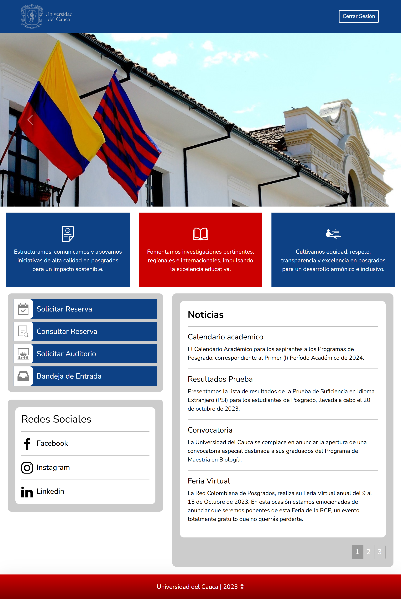

<h1 align="center">
  Sistema de Reserva de Salones
</h1>

Este proyecto es un sistema completo de reserva de salones, diseñado específicamente para el área de posgrados de la Universidad del Cauca. Está compuesto por un backend desarrollado en Spring Boot y un frontend en React.

## Tabla de Contenidos

- [Tecnologías Utilizadas](#tecnologías-utilizadas)
- [Instalación](#instalación)
- [Equipo de Proyecto](#equipo-de-proyecto)
- [Preview](#preview)

## Tecnologías Utilizadas

<p align="center">
   
   
   
   
   
   
   
</p>

## Instalación

Sigue estos pasos para instalar y ejecutar el proyecto localmente:

### Backend

1. Clona el repositorio:
   ```sh
   git clone https://github.com/FaberOs/Sistema-Reserva-Salones.git
   ```
2. Navega al directorio del backend:
   ```sh
   cd Sistema-Reserva-Salones/Backend
   ```
3. Construye y ejecuta cada servicio:
   ```sh
   cd api-service-auth
   ./mvnw spring-boot:run
   # Repite para cada servicio en los subdirectorios correspondientes
   ```

### Frontend

1. Navega al directorio del frontend:
   ```sh
   cd Sistema-Reserva-Salones/Frontend
   ```
2. Instala las dependencias:
   ```sh
   npm install
   ```
3. Ejecuta la aplicación:
   ```sh
   npm start
   ```

## Equipo de Proyecto

- [Faber Ospina](https://github.com/FaberOs)
- [Hamilton Pipicano](https://github.com/HamiltonP2018)

## Preview

<p align="center">
  
</p>
